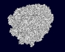
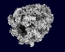

##Molekel

Multiplatform molecular visualization/analysis program.
[Website](http://molekel.cscs.ch)

TBD: images, link to presentation

##Crystal Viewer

Real-time visualizaiton of large (multi-million atoms) chemical compounds.
Features:
* color coding of scalar fields
* picking of individual atoms
* support for symmetry and replication of unit cell 


##Interactive visualization for quantum chemistry

Research on techniques for visualizing molecular orbitals from direct
real-time evaluation of approximate solutions to the Schroedinger equation.

Paper, articles and poster published.

##Graphics kernel for interactive molecular modeling

Some features:

* precomputed ambient occlusion of molecular surfaces(SES & SAS).
* real-time ambient occlusion of animated molecules
* order-correct transparency to mix surfaces with atoms and bonds
* volume-rendering of scalar fields, orbitals & density matrix
* real-time rendering of multi-million atom datasets 
* application of user defined programmable shaders to any graphical object
* high quality output suitable for publications
* distributed version through equalizer graphics
* novel approach to distributed rendering and compositing based on MPI(MVAPICH2) and
  direct GPU to GPU transfer

##Ambient occlusion

Precomputed and real-time ambient occlusion.

##Real-time raytracing of quadric surfaces

##QLua

##OpenBabel

Contributed code to parse and interpret quantum chemistry data formats.

##ParaView/VTK

Contributed real-time raytracing code to particle renderer. 

##(GP)GPU programming 

##Parsley

##LoCO.js

##QLua

##Free Dimensions

##sMesh

##Single image

---
#Tests

<a href="gallery/bones_ao.jpg" 
 rel="lightbox" 
 title="Synthetic bone model with ambient occlusion">image</a>


##Multiple images
<a href="gallery/chaperonine_no_ao.jpg"
 rel="lightbox[ao1]"
 title="Chaperonine molecule: no ambient occlusion">image</a>
<a href="gallery/chaperonine_ao.jpg"
 rel="lightbox[ao1]"
 title="Chaperonine molecule: ambient occlusion">image</a>
<a href="gallery/chaperonine_ao_phong.jpg"
 rel="lightbox[ao1]"
 title="Chaperonine molecule: ambient occlusion and phong shading">image</a>

##Thumbnails

<table style='border-collapse: collapse'>
<tr style='border-bottom: 0'>
<td style='border-bottom: 0'><a href="gallery/chaperonine_no_ao.jpg"
 rel="lightbox[ao2]"
 title="Chaperonine molecule: no ambient occlusion">
 
</a></td>
<td>
<a href="gallery/chaperonine_ao.jpg"
 rel="lightbox[ao2]"
 title="Chaperonine molecule: ambient occlusion">
 
</a>
</td>
</tr>
</table>

##Video(Youtube)

To center: wrap iframe with

```
<div style="text-align: center">
...
```

To avoid having the youtube video cover other items on the page add ```?wmode=transparent``` to the youtube embed url.


<div style="text-align: center">
<iframe width="560" height="315" style="margin: 0 auto" src="http://www.youtube.com/embed/p3mS-BkFxec?wmode=transparent" frameborder="0" allowtransparency="true" allowfullscreen="true"></iframe>
</div>

