---

layout: default

lightbox: true

imagehover: true

title: molecular modeling, functional representations, real-time graphics, data analysis ...  

---

...just some stuff I have been working on.

This a mix of personal and work-related projects which got discontinuted and/or turned 
into personal ones; in many cases the code and documents are not yet publicly available because:

* I do not have time _OR_
* I am waiting to find the time to publish a paper/article  _OR_
* I need to make sure I can legally opensource the project under the proper license.

Most of the stuff on this page is here because I could produce good-enough looking pictures and/or is easy to describe in one paragrah; things like e.g. embedded noQSL databases and tools for automated parsing and analysis of financial information are not shown :-)

Hover on the banners to add colors.

#Molekel

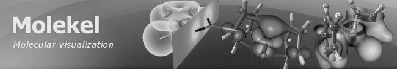

Multi-platform molecular visualization/analysis program. Started as a proof
of concept to test the suitability of different software libraries
for various visualization tasks, it ended up
being a widely used software package(mainly due to the lack of alternatives).

Checkout the 
[presentation](http://www.slideshare.net/molekel/molekel-august-2009-acs-meeting) 
given (upon invitation) at the _American Chemical Society_ as well 
as gallery and videos on the official website.

[Website](http://ugovaretto.github.io/molekel/)

This project has been discontinued in 2010, but it is still being downloaded at
a rate of about 100 downloads per month.

Note that the real-time rendering quality(especially for electronic structure data) is
still unmatched by any of the free or commercial molecular visualization programs, mainly due to:

* the ability to apply custom vertex and fragment shaders to any object, with
  on-the-fly generation of the shader editor GUI directly from the compiled shaders 
* correct transparency through depth peeling
* high resolution output for high DPI printouts 
 
I am now working on my own at a very slow pace to build a replacement for the program with a
brand new rendering engine and trying to include some of the many feature requests(hundreds
of pages of email messages) received from users, including scripting, plugins and the ability to 
directly interface with the computing infrastructure (both HPC and grid/cloud).

I am expecting to release a 1.0 version sometime in 2016 under an open-source license.

#Crystal Viewer

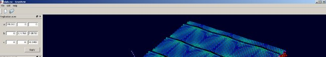

Real-time visualizaiton of large (multi-million atoms) chemical datasets.

Features:

* color coding of scalar fields
* picking of individual atoms
* support for symmetry and replication of unit cell 
* support for ShellX and custom developed file format which allows to include
  any number of per-atom properties

Discontinued; originally developed with another researcher and in collaboration with 
_EMPA_ (Swiss material science lab). 

#Interactive visualization for quantum chemistry

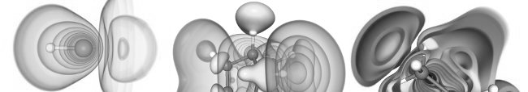

Research on techniques for analyzing molecules, scalar and vector fields from direct
real-time evaluation of approximate solutions to the Schroedinger equation.

Paper, article and posters published.

#Kernel for interactive molecular modeling and analysis

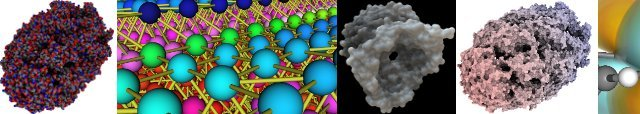

Some features:

* precomputed ambient occlusion of molecular surfaces (SES & SAS).
* real-time ambient occlusion 
* order-correct transparency to mix surfaces with atoms and bonds
* volume-rendering of scalar fields, orbitals & density matrix
* real-time rendering of multi-million atom datasets(with bonds)
* direct rendering of functional representations
* advanced 3D selection and picking: select any object with conditional
  queries or through 3D pickers controlled with the mouse and haptic devices
  and a new Kinect-like device (but **not** the Kinect itself) 
* application of user defined programmable shaders to any graphical object
* high quality output suitable for publications
* distributed version through _Equalizer Graphics_
* (experimental) novel approach to distributed rendering and compositing based on RDMA and
  direct intra- and inter-node GPU to GPU transfer
* fast (multithreaded and GPU-enabled) K-d tree implementation 
* interface to (custom) database systems to store structures and perform queries
  based on affinity/maximum likelyhood matching e.g. find structures
  with LUMO/HOMO orbitals with specific energies or compounds likely to
  bind with specific molecule at specific sites
* basic near-real-time Lennard-Jones molecular dynamics with simulation
  of individual subregions
* computation and animation of vibrational modes

This thing started with a proper analysis and design phase and was basically
frozen after having implemented separate working prototypes to verify the
feasibility of most of the features; many concepts from this research
are used in my new molecular modeling tool currently in the making; some
of the prototypes are or will be opensourced.

#(Inverse) global illumination

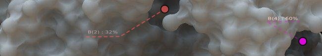

Research on how to infer features of 3d shapes from global illumination-related properties.

Cannot disclose more at this time. 

#Real-time raytracing of quadrics

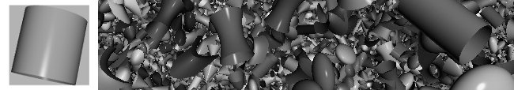

Implementation of a real-time ray-tracing engine using points and quadrangles
as proxy geometry for quadric primitives. 

Proxy geometry is optimal i.e. edges are tangent to the quadric surface
in screen space for most quadric types.

_OpenSceneGraph_ code available on _GitHub_, temporarily hosted in a private project.

#Parsley

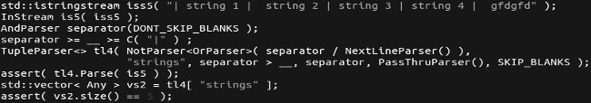

Parsing framework originally developed to extract and interpret data from results
of quantum chemistry/physics computations, also usable as a Parsing Expression
Grammar-like framework.

[Hosted on GitHub](http://github.com/candycode/parsley)

#LoCO.js

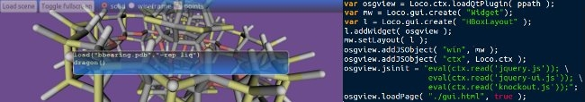

Multiplatform JavaScript/C++ application framework: Develop multiplatform desktop applications
with CoffeeScript/JavaScript/Python/Scheme...anything that compiles to
JavaScript, together with Knockout, jQuery(UI) or any of your favorite JS frameworks.

Implement modules as C++ loadable objects and use a scripting language as glue/controller.

Distribute apps as a single executable or a player application which downloads
objects on the fly.

Network(w/ SSL) services are provided with configurable resource access control.

Full integration with WebKit: expose any object to WebKit context.

[Hosted on GitHub](http://candycode.github.com/loco)

#QPy

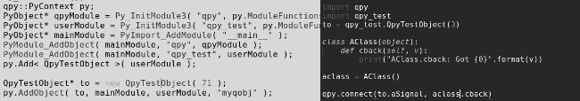

Qt-Python dynamic bindings: Make any QObject-derived type and/or instance
available in a Python context.

Connect:

* QObject signals to QObject slots
* QObject signals to Python functions
* QObject signals to Python methods

directly acces QObject properties and invokable methods from Python.

Construct instances of Qt objects from Python using the exposed
constructors.

[Hosted on GitHub](http://github.com/candycode/qpy)

#QLua

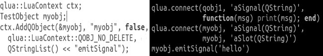

Make any QObject-derived class instance available to Lua; connect:

* QObject signals to QObject slots
* QObject signals to Lua callbacks

directly acces QObject properties and invokable methods from Lua.

[Hosted on GitHub](http://github.com/candycode/qlua)

#QTest

Library for macro recording and automatic testing of Qt GUI applications: record events and play them back at a
later at the desired speed.

Support for snapshots and checkpoints included.

One version, with no dependencies on _Molekel_ is already included in the _Molekel_ 
source code repository inside the <code>src/utility/events</code> directory. 

#F-Rep modeling

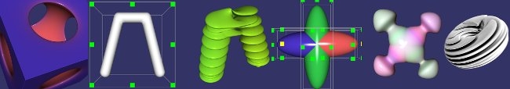

Attempts at building a 3D modeling application using only functional
representations and volumetric datasets with multi-dimensional transfer functions.
This is research I started on my own many years ago; with the latest developments in
hardware architectures it seems to finally be something possible to accomplish.

#AOWhiz

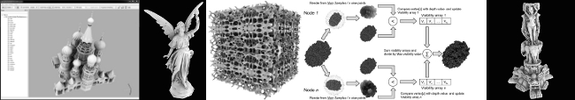

GUI application to generate ambient occlusion information from 3D meshes;
two versions developed: one based on _wxWidgets_, the other, together with another
developer, on _Qt_ to also perform a comparison of the two toolkits.

#Free Dimensions

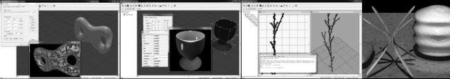

This is a program from the previous century. It started as  a proof of concept for a distributed
collaborative CAD/3D modeler where 3D objects had assigned permissions similar to files in 
file systems and any instance of the program could work as client and/or server.

Originally developed on SGI hardware and lately rewritten to work on Windows around 1998, also used 
as a workbench for experimenting with computer graphics algorithms, OpenGL and Windows GUI programming.
I also built a version to generate (animated) data for RenderMan compliant renderers, unfortunately 
I never had access to the real thing so the shader interface only works with BMRT.

Free Dimensions can generate any sort of geometry from F-Rep with CSG and blending to NURBS and has 
limited support for animation. It can also generate depth maps and perform preview of applied shadows 
and light maps (all done painfully slowly on the CPU). 
Last but not least it can export a 3D world to Windows, X, and Java3D source code.

It turns out that the program (together with BMRT 2.6) does work on Windows 7 (although with issues with resizing and when using multi-level undo/redo) 
including the scripting interface and some networking features.

#sMesh

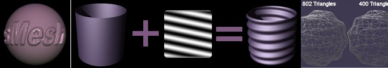

Another set of tools developed in the nineties, while still in college.

Subdivide with Catmull-Clark, Loop and other techniques, decimate high polygonal count
meshes, apply height maps to the surface normals.

#OpenBabel

Contributed code to parse and interpret quantum chemistry data formats.

#ParaView/VTK

Contributed real-time raytracing code to particle renderer.
Collaboration between EDF (France) and ETH Zuerich/CSCS.

