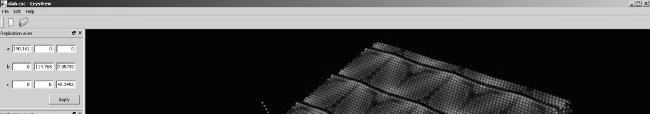
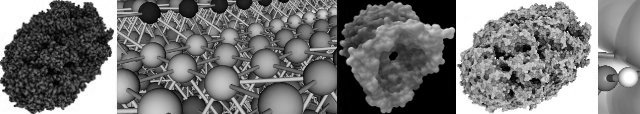
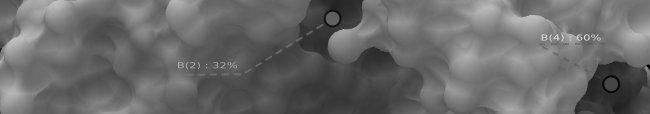
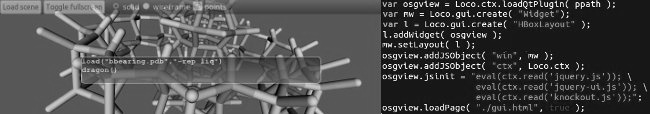
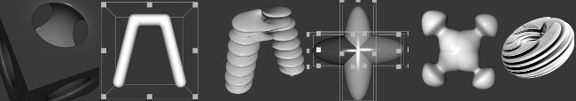
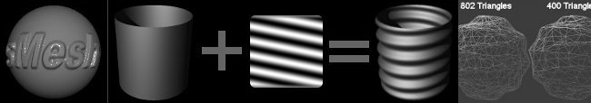

Just some stuff I worked on.

This a mix of personal and work-related projects carried on at ETH Zuerich/CSCS which got
discontinuted and/or turned into personal ones; in many cases the code and documents 
are not yet publicly available because:

* I do not have time _OR_
* I am waiting to find the time to publish a paper/article  _OR_
* I need to make sure I can legally opensource the project under the proper license. 

Hover on the banners to add colors.

Since I do have tons of presentations, whitepapers, images and movies related to 
these projects, in the future it will be possible to access additional resources
from this page. For the time being please do contact me directly in case you are
interested in any of these projects.

#Molekel

Multiplatform molecular visualization/analysis program. Started as a proof
of concept to test the suitability of different libraries, it ended up
being a widely used software package.

Checkout the 
[presentation](http://www.slideshare.net/molekel/molekel-august-2009-acs-meeting) 
given(upon invitation) at the _American Chemical Society_ as well 
as gallery and videos on the official website.

[Website](http://molekel.cscs.ch)

This project has been discontinued in 2010, but it is still being downloaded at
a rate of about 1k downloads per month.

I am now working on my own at a very slow pace to build a replacement for the program with a
brand new rendering engine and trying to include some of the many feature requests(hundreds
of pages of email messages) received from users, including scripting, plugins and the ability to directly interface with the computing infrastructure (both HPC and grid/cloud).

I am expectig to release a 1.0 version by fall/winter 2013 under a BSD-like license.

Since it turns out that quite a few pieces of the _Molekel_ program where extracted
and used in other software packages or to write papers without giving any credit,
I will not release any intermediate version of the program until I make at least a referenceable
publication somewhere(_arXiv_ is enough).

#Crystal Viewer

Real-time visualizaiton of large (multi-million atoms) chemical compounds.
Features:

* color coding of scalar fields
* picking of individual atoms
* support for symmetry and replication of unit cell 

Discontinued; originally developed with another researcher and in collaboration with 
_EMPA_(Swiss material science lab).

#Interactive visualization for quantum chemistry

Research on techniques for analyzing molecules, scalar and vector fields from direct
real-time evaluation of approximate solutions to the Schroedinger equation.

Paper, article and posters published.

#Kernel for interactive molecular modeling and analysis

Some features:

* precomputed ambient occlusion of molecular surfaces(SES & SAS).
* real-time ambient occlusion 
* order-correct transparency to mix surfaces with atoms and bonds
* volume-rendering of scalar fields, orbitals & density matrix
* real-time rendering of multi-million atom datasets(with bonds)
* direct rendering of functional representations
* advanced 3D selection and picking: select any object with conditional
  queries or through 3D pickers controlled with the mouse and haptic devices 
* application of user defined programmable shaders to any graphical object
* high quality output suitable for publications
* distributed version through _Equalizer Graphics_
* (experimental) novel approach to distributed rendering and compositing based on RDMA and
  direct intra- and inter-node GPU to GPU transfer
* fast (multithreaded and GPU-enabled) K-d tree implementation 
* interface to (custom) database systems to store structures and perform queries
  based on affinity/maximum likelyhood matching e.g. find structures
  with LUMO/HOMO orbitals with specific energies or compounds likely to
  bind with specific molecule at specific sites
* basic near-real-time Lennar-Jones molecular dynamics with simulation
  of individual subregions
* computation and animation of vibrational modes

This thing started with a proper analysis and design phase and was basically
frozen after having implemented separate working prototypes to verify the
feasibility of most of the features; many concepts from this research
are used in my new molecular modeling tool currently in the making; some
of the prototypes are or will be opensourced.

#(Inverse) global illumination

Research on how to infer features of 3d shapes from global illumination-related properties.

Cannot disclose more at this time. 

#Real-time raytracing of quadrics

Implementation of a real-time ray-tracing engine using points and quadrangles
as proxy geometry for quadric primitives. 

Proxy geometry is optimal i.e. edges are tangent to the quadric surface
in screen space for most quadric types.

OpenSceneGraph code available on GitHub, temporarily hosted in a private project.

#Parsley

Parsing framework originally developed to exctract and interpret data from results
of quantum chemistry/physics computations.

[Hosted on GitHub](http://github.com/candycode/parsley)

#LoCO.js

Multiplatform JavaScript/C++ application framework: Develop multiplatform desktop applications
with CoffeeScript/JavaScript/Python/Scheme...anything that compiles to
JavaScript, together with Knockout, jQuery(UI) or any of your favorite JS frameworks.

Implement modules as C++ loadable objects and use a scripting language as glue/controller.

Distribute apps as a single executable or a player application which downloads
objects on the fly.

Network(w/ SSL), services provided with configurable resource access control.

Full integration with WebKit: expose any object to WebKit context.

[Hosted on GitHub](http://locojs.net)

#QLua

Make any QObject-derived class instance available to Lua; connect:

* QObject signals to QObject slots
* QObject signals to Lua callbacks

directly acces QObject properties and invokable methods from Lua.

[Hosted on GitHub](http://github.com/candycode/qlua)

#QTest

Macro recording and automatic testing of Qt GUI applications: record events and play them back 
at a later time with the desired speed.

Support for snapshots and checkpoints included.

One version, with no dependencies on _Molekel_ is already included in the _Molekel_ 
source code repository inside the <code>src/utility/events</code> directory. 

#F-Rep modeling

Attempts at building a 3D modeling application using only functional
representations and volumetric datasets with multi-dimensional transfer functions.
This is research I started on my own many years ago; with the latest developments in
hardware architectures it seems to finally be something possible to accomplish.

#AOWhiz

GUI application to generate ambient occlusion information from 3D meshes;
two versions developed: one based on _wxWidgets_, the other, together with another
developer, on _Qt_ to also perform a comparison of the two toolkits.

#Free Dimensions

This is a program from the previous century. It started as  a proof of concept for a distributed CAD/3D modeler where 3D objects had assigned permissions similar to files in file systems
and any instance of the program could work as client and/or server.
Originally developed on SGI hardware and lately rewritten to work on Windows around 1998, used mainly as a workbench for experimenting with computer graphics algorithms, OpenGL and Windows GUI programming. I also built it to generate (animated) data for RenderMan compliant renderers, unfortunately I never had access to the real thing so the shader interface only works with BMRT.

Free Dimensions can generate any sort of geometry from F-Rep with CSG and blending to NURBS and has limited support for animation. It can also generate depth maps and perform preview of applied shadows and light maps (all done painfully slowly on the CPU). Last but not least it can export a 3D world to Windows, X, and Java3D source code.

It turns out that the program (together with BMRT 2.6) does work on Windows 7 (although with issues with resizing and when using multi-level undo/redo) including the scripting interface and some networking features.

#sMesh

Another set of tools developed in the nineties, while still in college.

Subdivide with Catmull-Clark, Loop and other techniques, decimate high polygonal count
meshes, apply height maps to the surface vertices.

#OpenBabel

Contributed code to parse and interpret quantum chemistry data formats.

#ParaView/VTK

Contributed real-time raytracing code to particle renderer.
Collaboration between EDF(France) and ETH Zuerich/CSCS.

