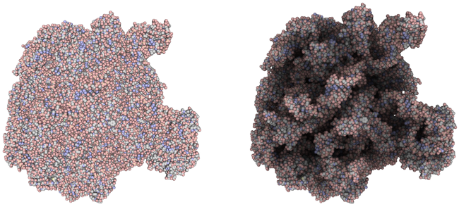

This is a partial list of semi-active projects currently
hosted on _GitHub_. They represent a subset of the list found in the _Portfolio_
section, which also includes some projects not yet open-sourced or simply
unmaintained or discontinued.

[Real-time ambient occlusion](ambient_occlusion/)
-------------------------------------------------

Real-time ambient occlusion, developed to enable better spatial perception
of visualized (animated) 3D scientific data sets.

[Parsley](http://github.com/candycode/parsley)
----------------------------------------------

Parsing framework originally developed to exctract and interpret data from results
of quantum chemistry/physics computations.

[LoCO.js](http://candycode.github.com/loco)
-------------------------------------------

JavaScript/C++ application framework: Develop multiplatform desktop applications
with CoffeeScript/JavaScript/Python/Scheme...anything that compiles to
JavaScript, together with Knockout, jQuery(UI) or any of your favorite JS frameworks.

Implement modules as C++ loadable objects and use a scripting language as glue/controller.

Distribute apps as a single executable or a player application which downloads
objects on the fly.

Network(w/ SSL), services provided with configurable resource access control.

Full integration with WebKit: expose any object to WebKit context and control
the WebKit context from an external parent context.

[QPy](http://github.com/candycode/qpy)
--------------------------------------

Qt-Python dynamic bindings: Make any QObject-derived type and/or instance
available in a Python context.

Connect:

* QObject signals to QObject slots
* QObject signals to Python functions
* QObject signals to Python methods

directly acces QObject properties and invokable methods from Python.

Construct instances of Qt objects from Python using the exposed
constructors.

[QLua](http://github.com/candycode/qlua)
----------------------------------------

Make any QObject-derived class instance available to Lua; connect:

* QObject signals to QObject slots
* QObject signals to Lua callbacks

directly acces QObject properties and invokable methods from Lua.

_...to be continued_

